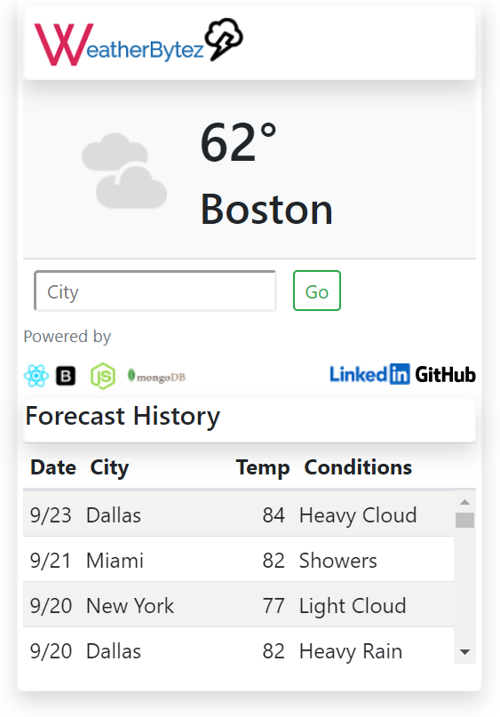

## WeatherBytez

Another Weather App? Well, mine is an example of organized MVC architecture based on API>Service>DAO in the backend, React is our View(UI). We use Express for the REST API server only, no middleware piping. All design pattern backend.

React > Forecast REST APIs > Forecast Services > Weather DAOs

## Technologies used...

UI - React, Bootstrap, Fetch, Webpack

API/Backend - Nodejs, Express, MongoDb

## Tools used:

- Visual Studio Code https://code.visualstudio.com/
- GIT Client https://git-scm.com/downloads
- Node.js https://nodejs.org/en/
- REACT can be downloaded within the Terminal in VSCode using NPM
- REACT install - Select folder to install React and type npx create-react-app views

* By using 'views' as your 'app' name, a folder in the MVC pattern gets created

## Production Build

- When building a Prod build for React (npm run build), we can copy the contents of the build into the public folder if we want Express to be our 'web server' also. This way you don't have standup a 'Web' web app server and a 'NodeJS' web app server. The NodeJS web app server is enough for serving smaller apps.
